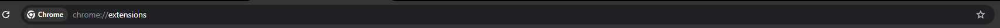

# BTK Hackathon 2024 - Hesoyam - Search Buddy
> Bu proje BTK Hackathon 2024 için Hesoyam ekibi tarafından geliştirilmiştir.
 
## Proje Amacı
Projemizin amacı, kullanıcıların internet üzerinde araştırmaya çalıştıkları konular hakkındaki makale veya döküman gibi kaynakları
arama süreçlerinin daha verimli bir hale getirmeye çalışmaktır. İnternet üzerinde doğru kaynaklara ulaşmayı zorlaştıran hatalı arama cümleleri veya ifadeleri, kullanıcıların doğru kaynaklara ulaşmasını engellemektedir. Projemizin amacı, kullanıcı ile yapılan sohbetlerdeki konu üzerine yapılan soru cevapları analiz ederek ihtiyaç duyulan bilgiyi internet üzerinde aramak için nokta atışı arama cümlelerine dönüştürmektir. Bu şekilde, kullanıcılar daha isabetli arama terimleri kullanarak hızlı ve kolay bir şekilde aradıkları kaynaklara ulaşabilir.

## Kullanılan Teknolojiler

- node.js
- express.js
- google/generative-ai
- fetch

## Projeyi Ayağa Kaldırmak

Gereksinimler:
- node

Proje Kurulumları:

1. `git clone https://github.com/Emopusta/BTK-Hackathon24.git` ile projeyi bilgisayarınıza indiriniz.

Backend:

1. cmd veya benzeri bir cli kullanarak **hesoyam-api** dosya dizinine gidiniz.
2. `npm install` ile dependency'leri indiriniz.
3. ardından .env adında bir dosya ekleyiniz.
4. .example.env dosyası içerisindeki örneklerden yola çıkarak .env dosyanızın içini doldurunuz
5. .example.env ile .env dosyasının aynı dizinde olduğundan emin olunuz.
6. Config key ve valueların doğruluğundan emin olunuz.
7. `npm run dev` ile backend'i ayağa kaldırınız.

Chrome-Extension:

1. Google chrome web browser'ı açınız.
2. `chrome://extensions/` url'ine gidiniz.
    - 
3. `Load Unpacked` seçeneğine giriniz. 
    - 
4. konumdan `hesoyam-chrome-extension`'ın bulunduğu dosya dizinini seçiniz.
5. Sağ üstte bulunan uzantı bloğundan uzantımızı pinleyelim.
    - 
    - 
6. Pinlenen logoya tıklayarak **Hesoyam Search Buddy** uzantımızın arayüzüne girip sorular sorabilirsiniz.
    - 

## Demo

